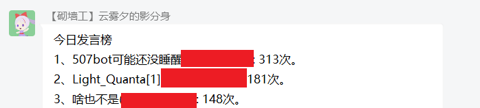

# QQ聊天机器人：507bot

> 基于[nonebot](https://github.com/nonebot/nonebot)（本项目已更新至[nonebot2](https://github.com/nonebot/nonebot2)）和[go-cqhttp](https://github.com/Mrs4s/go-cqhttp)的QQ聊天机器人，含有部分自己写的插件和别人开源的插件。这是个私人图一乐的项目，不保证代码的可读性和结构合理性，没有什么注释，只能说是我自己看得懂就行。

## 现有插件

plugin（第一代插件，对应版本：v0.3~v0.9）

|    插件名称    |                           插件功能                           |                           插件来源                           |                           特殊说明                           |
| :------------: | :----------------------------------------------------------: | :----------------------------------------------------------: | :----------------------------------------------------------: |
| arknight_gacha |           模拟明日方舟十连抽卡（卡池很久没更新了）           |                           自己写的                           |                  只支持所有角色均无up的情况                  |
|     baidu      |                       让我帮你百度一下                       |     [DeltaBot](https://github.com/233a344a455/DeltaBot)      |                           见原作者                           |
|    bilibili    |              推送b站主播的动态（含视频和直播）               | [QQBot_bilibili](https://github.com/wxz97121/QQBot_bilibili) |                           见原作者                           |
|      cmd       |    roll点、**特定消息自动回复（bot的主要机能）**，含开关     |                           自己写的                           | 为了符合群友的xp设置的内容，图一乐。图片回复需要在本地保存了相应图片 |
|    couplet     |                            对对联                            |     [DeltaBot](https://github.com/233a344a455/DeltaBot)      |                           见原作者                           |
|      emj       |             抽象话转换器：将中文文本转换为抽象话             | 自己写的，抽象转换词典来自[chouxianghua](https://github.com/chenxuuu/chouxianghua) | 同文件夹下的`emojiDef.py`定义了汉字转拼音和拼音转抽象话的字典。因为文件太长所以分了另一个文件放 |
|     lyric      |                  爬取并发送网易云音乐的歌词                  |                           自己写的                           |      使用了网易云接口（包括歌曲搜索接口、歌词获取接口）      |
|     record     |                    发送语言消息的自动回复                    |                           自己写的                           |                   都是lulu~~和雾妹~~的语音                   |
|      star      |                    查看不同星座的当日运势                    | csdn一篇[博客](https://blog.csdn.net/rain_web/article/details/70767279)抄的，自己改成了机器人的接口 |                           见原博主                           |
|     super      |                     管理员功能（含私货）                     |                           自己写的                           | 除了强制关闭外基本没用，黑名单和模块管理功能分散在各个模块里 |
|     teach      |           让群友教bot在群友特定发言下进行特定回复            |                           自己写的                           | 写入本地文本文件而不是直接加入功能模块，防止bot被群友玩恶堕。有意思的回复自己手动加就行 |
|      time      |         提取自然语言中的时间并转换成标准时间格式发送         | 模块是自己写的，功能实现的库来自[Time_NLP](https://github.com/zhanzecheng/Time_NLP) |                           见原作者                           |
|   translate    |               翻译，中译英或其他语种翻译成中文               |                           自己写的                           |                 用了有道翻译的接口并爬取结果                 |
|    weather     |                  依据省份和城市查看实时天气                  |                           自己写的                           | 使用中央气象台的接口（含省份代码接口、城市代码接口、天气查询接口） |
|      NLP       |                自然语言处理，简单的机器人聊天                |     [DeltaBot](https://github.com/233a344a455/DeltaBot)      |                           见原作者                           |
|   wordViewer   | 背单词，词库为考研5500单词（大概），共有三种模式。使用指令'单词'呼出帮助菜单 |                           自己写的                           | 同文件夹下的`words.py`包含所有的单词。单词来源于[这个网站](https://image.kuakao.com/2019/1210/20191210103558276.pdf) |
 
 

 

plugin2（第二代插件，第一代的重构和后续更新，对应版本v1.0~v1.2）

|  插件名称  |                           插件功能                           |                           插件来源                           |                           特殊说明                           |                           使用示例                           |
| :--------: | :----------------------------------------------------------: | :----------------------------------------------------------: | :----------------------------------------------------------: | :----------------------------------------------------------: |
|   baidu    |                       让我帮你百度一下                       |     [DeltaBot](https://github.com/233a344a455/DeltaBot)      | 见原作者，该模块的接口貌似已经不可用，已从插件中移除，但未在本库中移除 |                          （已移除）                          |
|  bilibili  |              推送b站主播的动态（含视频和直播）               | [QQBot_bilibili](https://github.com/wxz97121/QQBot_bilibili) |                           见原作者                           | 使用"关注列表"命令查看关注的主播和推送到的群聊，推送是被动推送，不可主动调用 |
|    roll    |                            roll点                            |                           自己写的                           |                   可以设定最大值的随机骰子                   |                           "roll 6"                           |
|  couplet   |                            对对联                            |     [DeltaBot](https://github.com/233a344a455/DeltaBot)      |                           见原作者                           |                      "对联 一去二三里"                       |
|    emj     |             抽象话转换器：将中文文本转换为抽象话             | 自己写的，抽象转换词典来自[chouxianghua](https://github.com/chenxuuu/chouxianghua) | 同文件夹下的`emojiDef.py`定义了汉字转拼音和拼音转抽象话的字典。因为文件太长所以分了另一个文件放 |                        "抽象 给爷爬"                         |
|   lyric    |                  爬取并发送网易云音乐的歌词                  |                           自己写的                           |      使用了网易云接口（包括歌曲搜索接口、歌词获取接口）      |                        "歌词 エルマ"                         |
|    memo    | 以一周为一个轮回，记录每天的备忘消息，可用于追番提醒和查询游戏每日掉落等 |                           自己写的                           |                 使用"备忘 菜单"呼出功能菜单                  |                   "备忘 菜单"查看详细说明                    |
|   record   |                    发送语言消息的自动回复                    |                           自己写的                           |                     都是lulu和雾妹的语音                     | 自动回复，代码中的`record_list`的键值为触发的字符串，使用部分匹配 |
|  replyer   |                     文本和图片的自动回复                     |                           自己写的                           |                   自动回复，bot的主要机能                    | 自动回复，代码中的`mes1`为全字匹配的条目，`mes2`为部分匹配，`mes3`为过滤器 |
|   speak    |                          文字转语音                          |                           自己写的                           |                    只是单纯的调用CQ码而已                    |                         "说话 你好"                          |
|    star    |                    查看不同星座的当日运势                    | csdn一篇[博客](https://blog.csdn.net/rain_web/article/details/70767279)抄的，自己改成了机器人的接口 |              **星座运势的api又双叒叕不能用了**               |                    (已移除)"运势 水瓶座"                     |
|   super    |                          管理员功能                          |                           自己写的                           |                  强制关闭、黑名单、模块管理                  |                   "管理员菜单"查看详细指令                   |
|   teach    |           让群友教bot在群友特定发言下进行特定回复            |                           自己写的                           | 写入本地文本文件而不是直接加入功能模块，防止bot被群友玩恶堕。有意思的回复自己手动加就行 |                    "学习 谁是bot 我是bot"                    |
| translate  |               翻译，中译英或其他语种翻译成中文               |                           自己写的                           |                 用了有道翻译的接口并爬取结果                 |                         "翻译 起飞"                          |
| whatAnime  |         通过番剧的截图查询图片来源番剧、剧集和时间点         |       [XUN_Bot](https://github.com/Angel-Hair/XUN_Bot)       | 该功能本质是使用了[trace.moe](https://trace.moe/)提供的接口。该接口在2021.6.30进行过一次更新，该插件的原作者使用的接口已经不可用，我在其基础上改成了新的接口 |                         "识番"+图片                          |
|  weather   |                  依据省份和城市查看实时天气                  |                           自己写的                           | 使用中央气象台的接口（含省份代码接口、城市代码接口、天气查询接口） |                       "天气 湖南 长沙"                       |
|    NLP     |                自然语言处理，简单的机器人聊天                |     [DeltaBot](https://github.com/233a344a455/DeltaBot)      |                           见原作者                           |                     "nlp 今天也是好天气"                     |
| wordViewer | 背单词，词库为考研5500单词（大概），共有三种模式。使用指令'单词'呼出帮助菜单 |                           自己写的                           | 同文件夹下的`words.py`包含所有的单词。单词来源于[这个网站](https://image.kuakao.com/2019/1210/20191210103558276.pdf) |                      "单词"查看详细指令                      |

 

plugin3（第三代插件，插件升级到nonebot2，以及后续更新，对应版本v2.0~）

|  插件名称  |                           插件功能                           | 插件来源(带\*号表示该插件原本为nonebot框架，我改成了nonebot2框架) |                           特殊说明                           |                           使用示例                           |
| :--------: | :----------------------------------------------------------: | :----------------------------------------------------------: | :----------------------------------------------------------: | :----------------------------------------------------------: |
|  bilibili  |              推送b站主播的动态（含视频和直播）               | \*[QQBot_bilibili](https://github.com/wxz97121/QQBot_bilibili) |        见原作者。该模块我还没有迁移完成，等待后序更新        | 使用"关注列表"命令查看关注的主播和推送到的群聊，推送是被动推送，不可主动调用 |
|    roll    |                            roll点                            |                           自己写的                           |                   可以设定最大值的随机骰子                   |                           "roll 6"                           |
|  couplet   |                            对对联                            |    \*[DeltaBot](https://github.com/233a344a455/DeltaBot)     |                           见原作者                           |                      "对联 一去二三里"                       |
|   emoji    |             抽象话转换器：将中文文本转换为抽象话             | 自己写的，抽象转换词典来自[chouxianghua](https://github.com/chenxuuu/chouxianghua) | 同文件夹下的`emojiDef.py`定义了汉字转拼音和拼音转抽象话的字典。因为文件太长所以分了另一个文件放 |                        "抽象 给爷爬"                         |
| musicShare |            在群里分享歌曲，支持网易云音乐和QQ音乐            |                           自己写的                           | 使用"音乐"命令调用网易云接口，使用"QQ音乐"命令调用QQ音乐接口 |                        "歌词 エルマ"                         |
|    memo    | 以一周为一个轮回，记录每天的备忘消息，可用于追番提醒和查询游戏每日掉落等 |                           自己写的                           |                 使用"备忘 菜单"呼出功能菜单                  |                   "备忘 菜单"查看详细说明                    |
|  replyer   |                  文本、图片、语音的自动回复                  |                           自己写的                           |                   自动回复，bot的主要机能                    | 自动回复，代码中的`mes1`为全字匹配的条目，`mes2`为部分匹配，`mes3`为过滤器 |
|   speak    |                          文字转语音                          |                           自己写的                           |                    只是单纯的调用CQ码而已                    |                         "说话 你好"                          |
|    star    |                    查看不同星座的当日运势                    | csdn一篇[博客](https://blog.csdn.net/rain_web/article/details/70767279)抄的，自己改成了机器人的接口 |                     api目前仍能正常使用                      |                        "运势 水瓶座"                         |
|   teach    |           让群友教bot在群友特定发言下进行特定回复            |                           自己写的                           | 写入本地文本文件而不是直接加入功能模块，防止bot被群友玩恶堕。有意思的回复自己手动加就行 |                    "学习 谁是bot 我是bot"                    |
| translate  |               翻译，中译英或其他语种翻译成中文               |                           自己写的                           |                 用了有道翻译的接口并爬取结果                 |                         "翻译 起飞"                          |
| whatAnime  |         通过番剧的截图查询图片来源番剧、剧集和时间点         |      \*[XUN_Bot](https://github.com/Angel-Hair/XUN_Bot)      | 该功能本质是使用了[trace.moe](https://trace.moe/)提供的接口。该接口在2021.6.30进行过一次更新，该插件的原作者使用的接口已经不可用，我在其基础上改成了新的接口 |                         "识番"+图片                          |
|  weather   |                  依据省份和城市查看实时天气                  |                           自己写的                           | 使用中央气象台的接口（含省份代码接口、城市代码接口、天气查询接口） |                       "天气 湖南 长沙"                       |
|    NLP     |                自然语言处理，简单的机器人聊天                |    \*[DeltaBot](https://github.com/233a344a455/DeltaBot)     |                           见原作者                           |                     "nlp 今天也是好天气"                     |
|    word    | 背单词，词库为考研5500单词（大概），共有三种模式。使用指令'单词'呼出帮助菜单 |                           自己写的                           | 同文件夹下的`words.py`包含所有的单词。单词来源于[这个网站](https://image.kuakao.com/2019/1210/20191210103558276.pdf) |                      "单词"查看详细指令                      |
|    poke    |                    使用手机QQ的戳一戳功能                    |                           自己写的                           |                      单纯地调用CQ码而已                      |                           "戳 xxx"                           |
|   super    |                          管理员功能                          |                           自己写的                           |        目前只支持"说"和"自爆"，黑名单和模块管理被移除        |                     "管理员菜单"查看详细                     |

 

---------------------

## 更新日志

v0.3

v0.3版本下首次开源

v0.4

- 新增模块管理功能：模块名+启用/禁用可以进行模块开关而不需要重启整个bot
- 新增黑名单功能：模块名+黑名单/出狱+QQ号可以对用户进行特定模块使用的禁用和解除
- 删除了原有模块管理的文件操作功能（原本的模块管理功能由py模块文件的删除和复制实现，需要重启bot才能应用更新）
- 新增了翻译的屏蔽词
- 天气指令优化：除了原来的天气+省份+城市之外，还支持天气+直辖市和天气+直辖市+具体地名的传参方式
  

v0.5

- 新增arknight_gacha模块，模拟明日方舟十连抽卡（卡池更新至画中人）
- 唤醒507bot由命令形式`@on_command`改成自然语言形式`@on_natural_language`（现在只要提及507bot就能唤醒）
- 回复关键词"雾宝"和"雾妹"时加入过滤选项，防止和雾宝bot进行无限聊天
- 发送歌词设置了最大上限(被群友发的圆周率之歌搞了一手
- 天气模块微调：查询台湾省天气时有特殊提示（台湾天气用现在实装的api查询不出来，更新前会导致查询无回复）
- 修正天气回复文本错误：原本api返回值的`rain`被我误认为下雨概率，经核实后改为降雨等级
- 新增部分无关紧要的自动回复
  

v0.6

- 现在能回复录音了
- 新增time模块，用于提取自然语言中的时间点并转换为标准时间
- 新增record模块，用于自动回复语音消息
- “来点怪歌”、“来点鬼叫”可以随机发送lulu的相关语音（需要本地文件）
- “lulu语录”、“るる语录”可以随机发送lulu的经典语录（同时删除了“lulu”和“るる”的自动回复防止冲突）
- 新增部分自动回复，对部分原有自动回复的内容进行了修改，部分触发过于频繁的回复改为几率触发
- **原有星座占卜的api似乎被关闭了，现在访问会超时，但是star模块还没有改动**，我大概率是准备摸了
  

v0.7

- 新增自动回复最高速度，定义在cmd插件中。现在机器人三秒内最多自动回复一次（只有聊天自动回复受限，用户正常调用的bot机能不受限制）
- 新增baidu模块，输入百度后接关键词可以对相关内容进行百度，本质是“让我帮你百度一下”http://tool.mkblog.cn/lmbtfy 的接口
- 新增emj模块，输入抽象后接字符串，如果有对应的话，可以将字符串中的中文汉字转换成emoji文字
  

v0.8

- 修改了星座运势的api，现在**星座运势功能又能够使用了**
- 新增了nlp模块，实现简单聊天功能，默认使用茉莉机器人的接口，在用户调用指令nlp时必然触发，一般聊天时按概率触发。该模块暂未添加模块禁用和黑名单以及闭嘴功能。
- 新增关注功能，可以通过输入关注+b站uid从而查询主播，写入本地文件等待机器人管理员审核
- 删去了nonebot的内置指令（echo指令居然被群友凭空试出来了）
- 管理员指令'说'的重复内容中，将方括号重新解码，从而能够通过说指令发送图片、语音等特殊消息。如：'说 [CQ:record,file=biezou.amr]'可以回复语音（需要存在本地语音文件）
- 新增自动消息回复，如'今天吃啥方便面'、'二次元'等，并把很多消息的固定回复内容改成了随机回复内容；删掉了部分聊天时触发过于频繁的自动回复
  

v0.9

- 关闭了完全用不上的时间自然语言插件，即`time`插件（但是我在github里保留下来了）
- 新增背单词插件`wordViewer`，使用命令"单词"呼出帮助菜单，词库为考研英语。包括以下三种功能：
  - 给出英文回答中文
  - 给出中文回答英文
  - 给出中文和缺省部分字母的英文，回答英文
- 为了维持上述单词插件的稳定性，停用了bilibili关注模块（这个模块一周会有那么一两次完全把程序卡死，不知道原因，也不知道怎么修这个bug）
- 从`go-http`学到了`[CQ:tts]`的玩法，新增`speak`模块，将**文字**转**语音**(而不是语音转文字！)
- 新增和修改部分简单的自动回复
  

v1.0

507bot更新到1.0版本啦！为什么是v1.0而不是v0.10呢？**507bot在本次更新中实现了大量的代码重构，之后模块更新统一在本库新增的plugins2文件夹下进行**，重构前的代码保存在plugin文件夹下。重构内容包括但不限于：

- 在根目录下使用`config.npy`统一管理模块，实现模块间的通信。`genConfig.py`用于生成上述文件，如果根目录不存在该文件，运行`run.py`时将会创建并初始化
- 模块开关终于能用一个单独的模块统一管理了，原本每个模块内都有一段冗长且相似的代码控制自身的开关
- 黑名单终于能统一了，原本每个模块有一个单独的黑名单
- 管理员权限终于不受NLP模块的限制使得权限需求消失了，老版本的时候如果管理员指令用NLP方法调用，则普通用户也能使用（这是nonebot自身的问题，我只是在代码实现中避免了该问题的出现）
- 极大简化了原本各个模块的代码（比如自动回复不再是每个单独做成一条指令了、黑名单和模块开关检查简化了等等）

下面是正常更新内容：

- 背单词模块将文件存取改成了二进制文件，且现在会区分群聊模式和私聊模式（沙雕群友私聊bot背单词没关，去水群的时候被bot背刺了）
- 背单词模块会每次被调用时会获取时间戳，如果太久没有继续背单词则bot会自行退出该用户的单词模式
- 去掉了没什么用的模块，修了些无关紧要的bug
- 新增和删除部分自动回复
  

v1.1

- 因为群友需要，又把`bilibili`模块加回来了
- 新增识番模块`whatAnime`，通过给出番剧截图来搜索图片来源的番剧、剧集、时间点
- 新增备忘模块`memo`，通过加入备忘条目，可以每周为一个轮回地查询设定的消息，如设置一周内每天的追番、一周内每天某游戏的材料掉落等。使用“备忘 菜单”呼出使用方式
- 新增和修改部分简单的文本、语音、图片自动回复
  

v1.2

- 重构发送图片内容的方式（见下面的bug说明）
- 配合群友们让bot学习的"来点xxx"自动回复，新增命令"来点"以不随机的方式查看自动回复的消息，如"来点 507bot 1"表示查看"来点507bot"自动回复的1号内容。新增命令"来点来点"查看所有以"来点"开头的自动回复的统计数据
- `bilibili`模块新增"关注列表"命令，查看所有关注的主播以及他们的b站消息会被推送到的群聊
- 新增和修改部分简单的文本、语音、图片自动回复
  

v2.0

~~为了方便我抄别人最新的插件，~~我决定把507bot的底层库**nonebot升级到nonebot2**。然而nonebot2并不能完全地向下兼容，因此我又不得不对全部的代码进行了重构，就这个机会又把bot的插件给去粗留精了一回。v2.0版本后的插件更新在本库的plugins3中。以下为更新内容：

- 把全部的库由nonebot架构重构迁移为nonebot2架构
- `bilibili`模块和`whatAnime`模块暂时不能用了，等待后续更新。前者还没成功迁移，后者的api似乎又改了
- 星座运势模块`star`又能使用了
- 考虑到发送语音的`record`模块和回复文本与图片的模块`replyer`的相似性，二者合并为同一个模块`replyer`
- 原本查询歌词的模块`lyric`所用的api失效了。重写的时候干脆一不做二不休，新版`musicShare`中直接实现了歌曲的分享，包括网易云音乐和QQ音乐。使用命令"(QQ)音乐 歌名"即可在群里生成分享卡片
- 修复了背单词模块`word`中，给英文猜中文时，输入单词词性或直接输入单词本身会判对的bug
- 修复了一些由v0版本升级到v1版本进行代码重构时遗留下来的bug（如`weather`模块失效等，大多都是没有导入相应的库造成的）
- 删除了平时用不上的模块和功能，包括管理员权限的黑名单和模块管理，以及之前的gif回放`gifReplay`、帮你百度一下`baidu`、明日方舟抽卡等模块（我好像忘记把有gif回放功能的版本上传github了？）
- 优化了各个模块的结构，使得模块文件夹`plugins`和bot的初级目录不再那么凌乱

------------------

## 严重Bug历史记录

展开/收回

### 2021.3.20：和其他机器人复读了起来(v0.6版本复读刷屏bug)

群里的机器人都是大家自己搭建的，架构和语言都不一样，这波是八仙过海。一共有五个机器人，但貌似只有我是用python写的==
引起这次灾难的本质是507bot会对含有特定关键词的内容进行回复，如对图片中的“mc”进行回复，而群里其他的机器人能够在一句话被复读一定次数后，概率进行复读，因此产生了刷屏现象：

最终导致了严重的后果：

在此基础上，更新的v0.7版本加入了回复速度阈值：调用自动回复的函数时获取当前的时间戳，如果与上次自动回复时的时间戳相差小于3秒就放弃回复。也就是说，自动回复的最快速度是三秒一次。虽然是这么说，但是我就是怕出现无限复读的情况，所以之前就给507bot实装过“闭嘴”功能用于临时停用自动回复，群友还玩这个功能玩了一阵子。一到关键时候一个都想不起来还有这一手。我麻了

### 2021.3.26:被封号了

可能是每天重复发送相同内容？或者是前一晚在测试bilibili模块关注多个主播（近20个）导致的？该小心点了。号申诉后秒解封了。

### 2021.3.28:b站动态推送错误

新增关注功能后群友们相互关注，导致推送动态的时候会报错从而导致大片的动态检测失效。经过反复测试（指不同账号在b站发动态）发现，如果关注列表中存在**没有发过任何动态**的账号，在检测该账号的动态更新时就会报错，从而使得关注列表中这个号和之后的号都不会被检测更新。这是bilibili模块的bug。想了想要不要加个try-except，最后还是算了。没有发过动态之后也不会发的人，关注了干嘛

### 2021.7.x~9.5:图片过期

在go-cqhttp的框架下，所有bot收到的qq图片会被保存在文件夹`\data\image`下，图片文件名为'xxxxx.image'，且该文件夹下的图片可以通过bot直接发送文本'[CQ:image,file=xxxx]'来转换成图片发送，我也一直是这么做的。到后来，很多自动回复的图片会莫名地失效，在命令行报错信息为图片上传失败，参数错误para error（在我之后更新过go-cqhttp后仍然有这个问题，但报错的提示变了）。因为图片保存在本地，我一直以为是图片本身出了问题或go-cqhttp出了bug，在尝试用各种二进制图片方式打开这些后缀名为image的图片以及查询go-cqhttp的issue无果后，我在阅读go-cqhttp的[文档](https://docs.go-cqhttp.org/guide/file.html#%E5%9B%BE%E7%89%87%E7%BC%93%E5%AD%98%E6%96%87%E4%BB%B6)时，发现这些保存在本地的图片其实只是一个二进制缓存文件，其中包含着该图片和QQ服务器对应的缓存文件。也就是说，每个image文件里包含一个url（后来我尝试直接将image文件用文本方式打开，也可以看到这个url），通过这个url去QQ的服务器找到相应的图片进行上传，从而实现图片的发送。当一张图片过期后，QQ服务器会将该图片清除，从而使得image文件对应的url失效，导致使用image文件发送图片失效。

简而言之，go-cqhttp保存在本地的image文件并不是图片本身，而是能够从QQ服务器中找到对应图片的url。QQ服务器清理了图片，从而使得图片失效了。我一直通过本地的image文件发送图片，但是这些文件并不是本地的图片，所以一段时间后尽管image文件还在，图片却发不了了。

从bot的1.2版本开始，我在'\data\image'文件夹下直接存放本地图片（'jpg'、'png'等常用格式的图片文件），同样用'[CQ:image,file=xxxx]'进行发送，而不使用image后缀的图片缓存文件，从而解决了这个问题。

-----------

## 其他说明

更新完全随缘，目标只为图一乐

